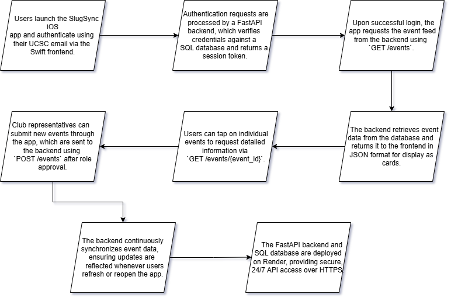

# SlugSync
SlugSync - A centralized events hub for UCSC students, with a FastAPI backend and Swift frontend so students don't have to manually search Instagram to find opportunities that could provide them real value.

## Problem Motivation
Many UCSC students face the challenge of finding opportunities/events to build their résumés and connect with others. Having personally faced this issue of missing out on great opportunities solely due to not knowing they existed, we built a solution. Previously, students had to dig through Instagram by searching for each club, and determining where and when the event was. Now, with SlugSync, students can find all the events within UCSC along with their details in one place. This also benefits clubs and organizations by increasing event visibility and turnout through improved awareness.    

## Solution Overview
- Aggregates club and organization events into a single centralized event feed
- Implements search and filtering functionality by organization, category, keywords, and event date
- Designed as a mobile-first platform with a native Swift iOS frontend

## Platform Features 

- Event Feed: Browse upcoming UCSC club events in one centralized feed.

- Search & Filters: Find events by date, category, or club type(Academic, Career, Sports, ...)

- Favorites: Save events you’re interested in.

- Club Submissions: Club reps can upload their own events directly through the app.

## Tech Stack

Frontend – Swift (iOS App):
We used Swift to build the iOS app, and it handles everything users see and interact with like buttons, event listings, and swiping features. By using Swift, we were able to make the app on iOS and make sure the users have a clear and easy-to-use interface.

Backend – FastAPI (Python):
The backend is powered by FastAPI, a modern and high-performance web framework for Python. It processes requests from the app, such as logging in users, fetching event data, and storing user preferences. FastAPI is known for being fast, easy to scale, and great for building APIs that communicate with mobile apps.

Database – SQL:
All the app’s data — like user accounts and events — is stored in an SQL database. This ensures that data is organized, easily accessible, and secure. The backend connects to the database to read or update data whenever needed.

Deployment – Render:
The FastAPI backend and database are deployed on Render, a cloud platform that hosts web apps and APIs. Render keeps the backend running online 24/7, so the iOS app can connect to it anytime. It automatically manages scaling, updates, and uptime.

## Backend Architecture & Core Functionality
- RESTful FastAPI backend supporting full CRUD operations for events:
(ADD SCREENSHOTS FROM RENDER)
  - Create:Authorized club representatives will post events through an API

  - Read:Users can retrieve event listings and details

  - Update:Event data can be modified by authorized users

  - Delete:Events can be removed through authorized requests

- Authentication and role-based access control (host vs. student)

- Filtering and query logic for efficient event retrieval

- Backend API with event CRUD operations: Link To API Documentation Page --> https://slugsync-1.onrender.com/docs?

## Application Screenshots (Screenshots will be added)

- The user opens the app and signs in with their UCSC email.

- The home screen shows all upcoming events in a card-swiping format.

- Swiping right saves the event to their “Interested” list; swiping left skips it.

- Users can tap an event to view details, location, and club info.

- Club reps can log in through a role-based interface to post new events.

## Application Workflow

## Running the App Locally

- The backend is deployed on Render, which hosts the FastAPI server for the repository.
- A SQL database is used for persistent storage, with credentials managed securely via environment variables.
- The iOS application can be run using the Xcode iOS Simulator, which connects to the Render-hosted backend to display and interact with live data.

## Future Outlook
- User Analytics
- Organizer Portal
- Android App
- RSVP Tracking
- Map Functionality
